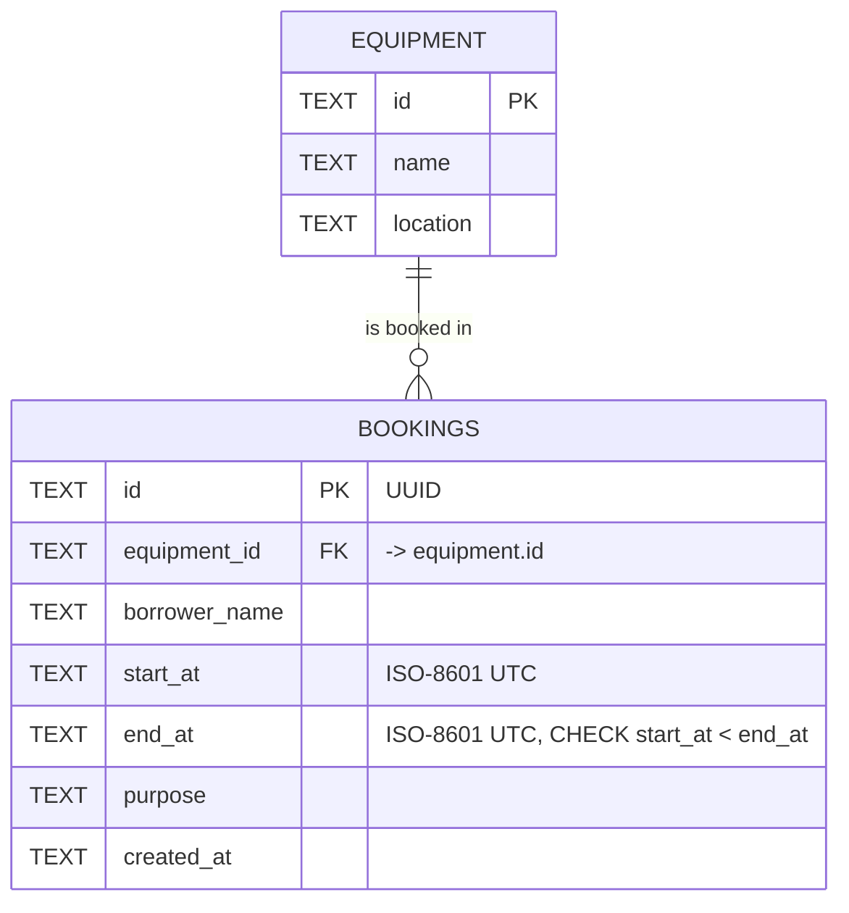

# Schema / ERD

- **Relationship:** one equipment has zero or many bookings; each booking belongs to exactly one equipment (`bookings.equipment_id → equipment.id`).
- **Why TEXT for times:** SQLite/D1 has no native datetime type. Every time is normalised to the same UTC ISO format, so string comparison (`<`, `>`) gives the correct time order. The overlap check depends on this.
- **Index** `(equipment_id, start_at, end_at)` supports the overlap query.
- **DB-level guard:** `CHECK (start_at < end_at)` prevents invalid ranges even if the API check is bypassed.

Source: [migrations/0001_init.sql](migrations/0001_init.sql)
